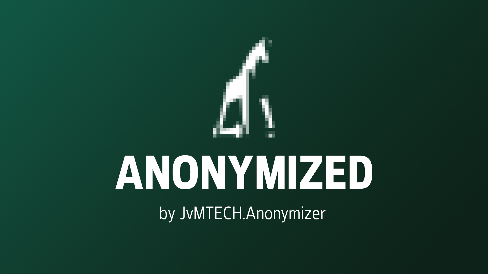

# JvMTECH.Anonymizer Package for Neos CMS #
[](https://packagist.org/packages/jvmtech/anonymizer)
[](https://packagist.org/packages/jvmtech/anonymizer)

Anonymize property values in Neos CMS NodeTypes and Neos Flow Domain Models.



## Installation
```
composer require jvmtech/anonymizer
```

## Supported property types

- Text
- DateTime
- Assets
  - text/csv
  - image/gif
  - image/jpeg
  - video/mp4
  - application/pdf
  - image/png
  - image/svg+xml
  - text/plain
  - video/webm
  - application/zip
  - application/vnd.oasis.opendocument.text
  - application/vnd.openxmlformats-officedocument.wordprocessingml.document
  - application/vnd.openxmlformats-officedocument.presentationml.presentation
  - application/vnd.openxmlformats-officedocument.spreadsheetml.sheet
  - Extensible via configuration..

## Configuration

```
JvMTECH:
  Anonymizer:
    nodeTypes:

      'Your.Vendor:Your.NodeType':
        properties:
          name:
            anonymize: true
          email:
            shuffle: true
          video:
            anonymize: true

    domainModels:

      'Your\Vendor\Domain\Repository\YourModelRepository':
        dateTimeFilter: # optional
          propertyName: 'creationDateTime'
          olderThan: -90 # days
          # olderThan: '2023-01-01 00:00:00' # or by date
        properties:
          name:
            anonymize: true
          email:
            shuffle: true
          video:
            anonymize: true
```

## Example Usage "Delete user data older than 90 days"

1. Add a "Your\Vendor\Domain\Repository\YourModelRepository" configuration with `dateTimeFilter.propertyName: 'creationDateTime'` and `dateTimeFilter.olderThan: -90`, and matching property settings
2. Run the anonymizer command `./flow anonymize:domainmodels --only "Your\Vendor\Domain\Repository\YourModelRepository" --force` once a month

## Example Usage "Create clean data for local development"

1. Add a "Your.Vendor:Your.NodeType" configuration with matching property settings
2. Clone the productive project container
2. Run the anonymizer commands `./flow anonymize:nodetypes --force` and `./flow anonymize:domainmodels --force`
3. Remove all assets you don't need anyways `./flow media:removeunused --assume-yes`
4. Do more specific stuff you need to do
5. Now make the clean container or the data dump accessible to your team

## Whishlist

- [x] Filter by datetime to handle automatic anonymization of old data
- [ ] Options to define type specific ranges
  - [ ] Ex. DateTime: "Randomize to +/- 6 Months from initial value"
  - [ ] Ex. Number: "Random number between 100 and 1000"
- [ ] Option to define custom anonymization methods
- [ ] Pixelation of assets, not just replacement
- [ ] **Other useful PR's and ideas are welcome!**

---

by [jvmtech.ch](https://jvmtech.ch)
